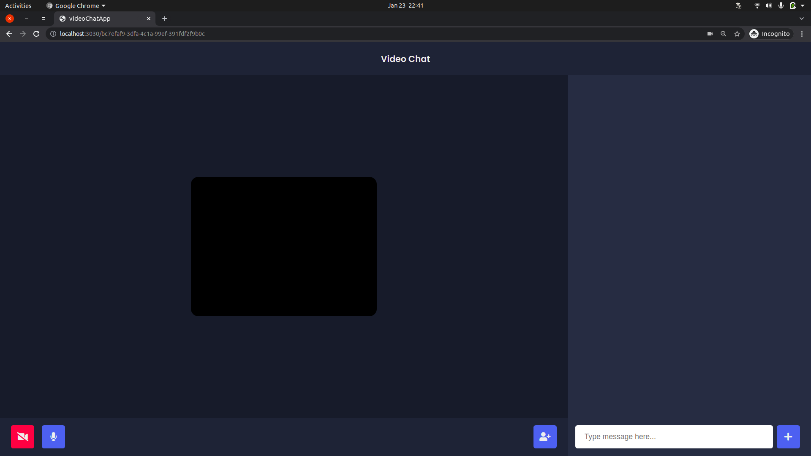

## Teamy
<br>

This is a video chat app. It lets you login with your name and then you are all set to go.
<br>



​                                                                     Figure 1.1


<br>

Here you can see the application when it opens up at your url. The button at middle-right will provide you with a link that you can send to your friends to join you at your call.

#### USE CASE :

- It can be useful for group calls

- It can be used in an orgnization call.

- Daily meetings can be done with this.

  and  many more uses as per need.

Functionalities:

- In- call chat is available
- Voice and video on-off is available.
- No limits for number of users.

#### How to Run This project

1 - Run 

```
npm install
```

2- Now run the below command

```
sudo npm install -g --force nodemon
```

3 - Finally start your server with the below command

```
nodemon server.js
```

Then open your browser and type localhost:3030

Your application will start and enjoy.

